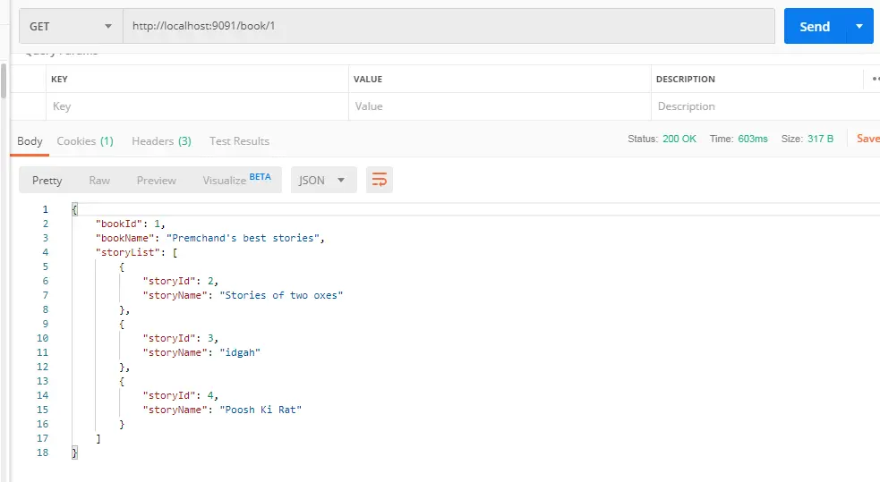

## 역할

```bash
beack -end / DB modeling
```

## 구현 파트
``` bash
STOMP를 활용한 실시간 채팅 기능 구현
```

## 1. real-time chat system
구현기간: 2021-04-19 ~ 


## 2. 엔티티 조인 / List 표현
###     더파이럿츠 입사 문제와 유사 : 데이터 입력 병렬 처리 방식 학습 필요

POST >>


GET>>


## 3. controller / service 추상화


## Reference

Link: [One To Many Mapping Annotation Example In Hibernate/JPA Using Spring Boot And Oracle][googlelink]

[googlelink]:
https://www.netsurfingzone.com/hibernate/one-to-many-mapping-annotation-example-in-hibernate-jpa-using-spring-boot-and-oracle/

